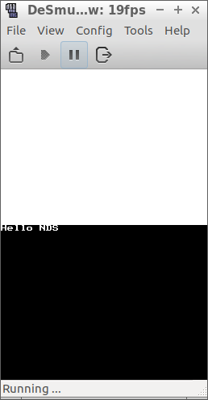

# travis_qmake_gcc_cpp98_libnds

This GitHub is part of 

 * [the Travis C++ Tutorial](https://github.com/richelbilderbeek/travis_cpp_tutorial)
 * [my NDS webpages](https://github.com/richelbilderbeek/cpp/blob/master/content/CppNds.md)

The goal of this project is to have a clean Travis CI build, with specs:

 * Build system: `qmake`
 * C++ compiler: `gcc`
 * C++ version: `C++98`
 * Libraries: `STL` and `libnds`
 * Code coverage: none
 * Source: one single file, `main.cpp`

More complex builds:

 * Use C++11: [travis_qmake_gcc_cpp11_libnds](https://www.github.com/richelbilderbeek/travis_qmake_gcc_cpp11_libnds)
 * Use C++14: [travis_qmake_gcc_cpp14_libnds](https://www.github.com/richelbilderbeek/travis_qmake_gcc_cpp14_libnds)

Less complex builds:

 * No `libnds`: [travis_qmake_gcc_cpp98](https://www.github.com/richelbilderbeek/travis_qmake_gcc_cpp98)

## External links

 * ['Hello World' using Qt Creator under Ubuntu for NDS](http://www.richelbilderbeek.nl/CppHelloWorldQtCreatorUbuntuNds.htm)
 * [devkitpro website](http://devkitpro.org)
 * [devKitPro buildscripts](https://github.com/devkitPro/buildscripts): to set up the environment